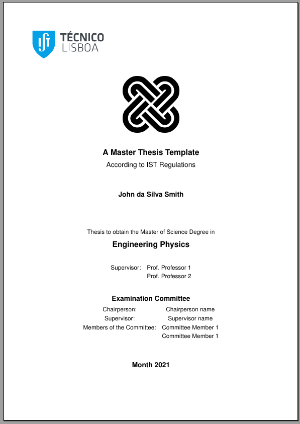
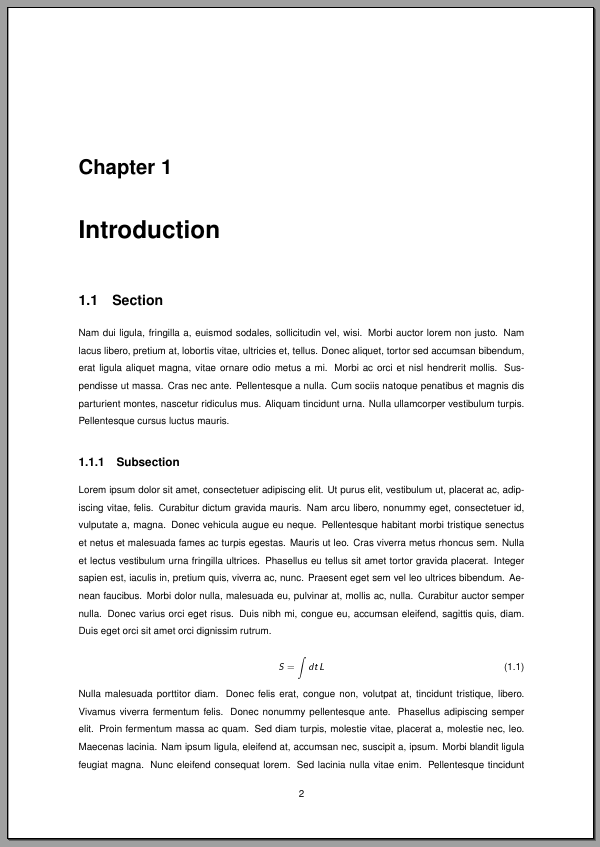

# IST Master Thesis Template

This is a Master Thesis Template that is in accordance with the guidelines of Instituto Superior Técnico. 

## How to use this template?

### Online: Overleaf

Just download the template and upload it to you overleaf account.

### Offline: TeXstudio

This is my prefered method to work with but some small tweaks must be made to TeXstudio so that it compiles the file properly.

Firstly, go to `Tools > Clean Auxiliary Files...` and add the following extensions:
```
log,aux,dvi,lof,lot,bit,idx,glo,bbl,bcf,ilg,toc,ind,out,blg,fdb_latexmk,fls,run.xml,gz,log,synctex.gz,acn,acr,alg,glg,gls,glsdefs,ist,nlg,nlo,nls
```
This is what I have in my TeXstudio at the momment and corresponds to auxiliary files from several different latex compilers, Tweak it as you please.

As a second step, go to `Options > Configure TeXstudio...` and search for the `build` tab. In the lower part of the window, you can add your own commands. The leftmost box is the name you wish to call your command while the rightmost box is the actuall command TeXstudio will run. Add the following two:
```
user 0: Make Nomenclature | makeindex -s nomencl.ist -t %.nlg -o %.nls %.nlo
user 1: Make Glossary     | makeglossaries %
```

These two commands will generate the glossary and the nomenclature files needed for compilation (similarly as to how TeXstudio creates a .bib file for the bibliography).
Two compile the document press the `Build and View` Command (or press f1). This will generate a pdf without the nomenclature and the glossary. To add them, go to `Tools > User` and run the two commands you created above. This will create the nomenclature files and the glossary files. If you now rebuild the document, you will have all parts in your ppf. This might seem like a lot of work but, as long as you dont change your glossary file or numemclature file,you only need to do this once.


## Project Structure

The project is structured as depicted below:

```
Main Folder
├── config
│     └── thesis_preamble.tex
│ 
├── bib
│     └── my_ref.bib
│ 
├── figures
│     └── example_image.png
│
├── inputs
│     ├── 01_Cover_Page
│     │     ├── thesis_front_cover.tex
│     │     ├── solomon.png
│     │     └── IST_A_CMYK_POS.pdf
│     │
│     ├── 02_Front_Matter
│     │     ├── thesis_front_cover.tex
│     │     ├── solomon.png
│     │     └── IST_A_CMYK_POS.pdf
│     │
│     ├── 02_Front_Matter
│     │     ├── Dedication.tex
│     │     ├── Acknowledgements.tex
│     │     ├── Abstract.tex
│     │     └── Abstract.tex
│     │
│     ├── 03_Glossary_and_Nomenclature
│     │     ├── Thesis_Glossary.tex
│     │     └── Thesis_Nomenclature.tex
│     │
│     ├── 04_Chapters
│     │     └──  Introduction.tex
│     │
│     ├── 05_Chapters
│     │     └──  Appendix.tex
│     │    
│     │
└── report_template.tex
```

The filenames are self explanatory and are commented so take a look around the files to get a better grasp of the innerworkings of the template. An advice to keep things organized is to take a look at the `thesis_preamble.tex` file where all packages and tweaks should be made. Regarding the bibliography, I highly recommend the use of JabRef to keep track of this file andto update it as you go. Finally, you should place all your images in the images folder. I usually make subfolders for specific parts of my document.

## Examples
  <p float="left">
  
  
</p>
  
## Aknowledgements

I want to leave here a public thank you to Pedro Cosme for the original template upon which this one was built.
